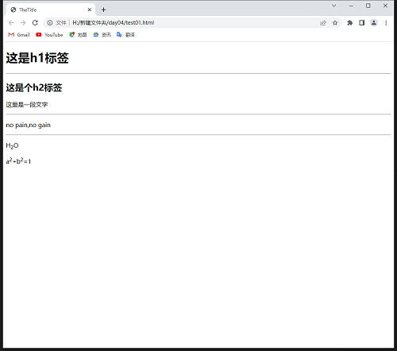

# html

## 1、定义

HTML，全称“Hyper Text Markup Language（超文本标记语言）”，简单来说，网页就是用HTML语言制作的。[html5参考手册：](./html5中文手册)

## 2、html基本结构

``` html
<!DOCTYPE html>
<html>
    <head>
        ···
    </head>
    <body>
        ···
    </body>
</html>
```

## 3、html的基本标签

### （1）HTML标签

整个网页以<html></html>标签为起止。

### （2）head标签

head标签代表页面的头部，定义一些特殊内容，一般为浏览器页面不可见内容。

| <head>标签内部标题 | 说明                                 |
| ------------------ | ------------------------------------ |
| <title>            | 定义网页标题                         |
| <meta>             | 定义网页基本信息（供搜索引擎搜索）   |
| <style>            | 定义css样式                          |
| <link>             | 链接外部css文件或脚本文件            |
| <script>           | 定义脚本语言                         |
| <base>             | 定义页面所有链接的基础定位（很少用） |

### （3）body标签

body标签代表页面的身体，定义网页的展示内容，一般都是浏览器可见的。以下标签都使用在body中。

## 4、段落和文字

### （一）、段落标签

##### （1）段落与文字标签

| 标签      | 语义            | 说明             |
| --------- | --------------- | ---------------- |
| <h1>~<h6> | header          | 标题             |
| <p>       | paragraph       | 段落             |
| <br>      | break           | 换行             |
| <hr>      | horizontal rule | 水平线           |
| <div>     | division        | 分割（块元素）   |
| <span>    | span            | 区域（行内元素） |

##### （2）文本格式化标签

| 标签     | 语义          | 说明 |
| -------- | ------------- | ---- |
| <strong> | strong        | 加粗 |
| <em>     | emphasize     | 斜体 |
| <cite>   | cite          | 引用 |
| <sup>    | superscriprtd | 上标 |
| <sub>    | subscripted   | 下标 |

### （二）、网页特殊符号

| 标签    | 说明 |
| ------- | ---- |
| &nbsp； | 空格 |

### （三）、自闭合标签

HTML标签分为“一般标签”和“自闭合标签”两种。一般标签有开始符号和结束符号，自闭合标签没有结束符号。

一般标签可以在开始和结束标签间插入其他标签和文字。

自闭合标签由于没有结束符号，只能定义自身属性。

##### （1）一般标签

如：<html>

##### （2）自闭合标签

如：<br>

### （四）、块元素和行内元素

（1）、HTML元素根据浏览器表现形式分为两类：①块元素；②行内元素；

（2）、块元素特点：

* 独占一行；
* 块元素内部可以容纳其他块元素或行元素。

常见的块元素有：h1~h6、p、hr、div等等。

（3）、行内元素特点：

* 可以与其他行内元素位于同一行。
* 行内元素内部可以容纳其他行内元素，但不可以容纳块元素。

常见行内元素有：strong、em、span等。

### （五）、应用

``` html
<!DOCTYPE html>
<html lang="en">
<head>
    <meta charset="UTF-8">
    <title>TheTitle</title>
</head>
<body>
    <h1>这是h1标签</h1>
    <hr>
    <h2>这是个h2标签</h2>
    <p>这里是一段文字</p>
    <hr>
    <p>no pain,no gain</p>
    <hr>
    <p>H<sub>2</sub>O</p>
    <p>a<sup>2</sup>+b<sup>2</sup>=1</p>
</body>
</html>
```

运行结果如下：

### （六）、标签的语义

## 5、列表

### （一）、HTML中的3种列表

### （二）、应用

## 6、表格

### （一）、表格基本结构

### （二）、表格完整结构

### （三）、合并行和合并列

## 7、图像

### （一）、图像标签

### （二）、相对路径和绝对路径

### （三）、图片格式

## 8、链接

## 9、表单

### （一）、input标签表单

### （二）、testarea标签表单

### （三）、select和option

### （四）、应用

## 10、多媒体

### （一）、插入音视频和flash

### （二）、插入背景音乐

## 11、浮动框架iframe

### （一）、简介

### （二）、设置滚动条scrolling

## 12、div标签和span标签

## 13、id属性和class属性

## 14、语义化


