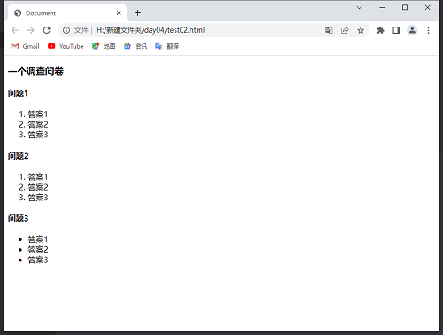
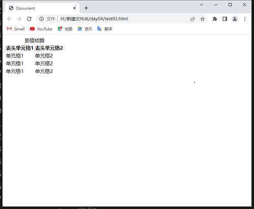
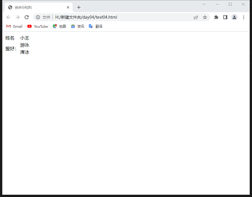
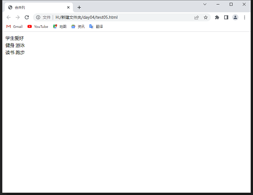
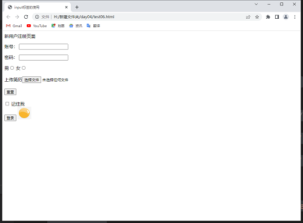
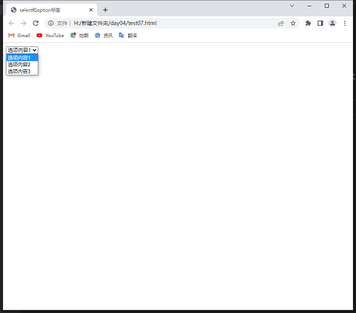

# html

## 1、定义

HTML，全称“Hyper Text Markup Language（超文本标记语言）”，简单来说，网页就是用HTML语言制作的。[html5参考手册：](./html5中文手册.chm)

## 2、html基本结构

``` html
<!DOCTYPE html>
<html>
    <head>
        ···
    </head>
    <body>
        ···
    </body>
</html>
```

## 3、html的基本标签

### （1）HTML标签

整个网页以html标签为起止。

### （2）head标签

head标签代表页面的头部，定义一些特殊内容，一般为浏览器页面不可见内容。

| head标签内部标题 | 说明                                 |
| ---------------- | ------------------------------------ |
| title            | 定义网页标题                         |
| meta             | 定义网页基本信息（供搜索引擎搜索）   |
| style            | 定义css样式                          |
| link             | 链接外部css文件或脚本文件            |
| script           | 定义脚本语言                         |
| base             | 定义页面所有链接的基础定位（很少用） |

### （3）body标签

body标签代表页面的身体，定义网页的展示内容，一般都是浏览器可见的。以下标签都使用在body中。

## 4、段落和文字

### （一）、段落标签

##### （1）段落与文字标签

| 标签  | 语义            | 说明             |
| ----- | --------------- | ---------------- |
| h1~h6 | header          | 标题             |
| p     | paragraph       | 段落             |
| br    | break           | 换行             |
| hr    | horizontal rule | 水平线           |
| div   | division        | 分割（块元素）   |
| span  | span            | 区域（行内元素） |

##### （2）文本格式化标签

| 标签   | 语义          | 说明 |
| ------ | ------------- | ---- |
| strong | strong        | 加粗 |
| em     | emphasize     | 斜体 |
| cite   | cite          | 引用 |
| sup    | superscriprtd | 上标 |
| sub    | subscripted   | 下标 |

### （二）、网页特殊符号

常用如`&nbsp；`等。

### （三）、自闭合标签

HTML标签分为“一般标签”和“自闭合标签”两种。一般标签有开始符号和结束符号，自闭合标签没有结束符号。

一般标签可以在开始和结束标签间插入其他标签和文字。

自闭合标签由于没有结束符号，只能定义自身属性。

##### （1）一般标签

如：`<html></html>`

##### （2）自闭合标签

如：`<br>`

### （四）、块元素和行内元素

（1）、HTML元素根据浏览器表现形式分为两类：①块元素；②行内元素；

（2）、块元素特点：

* 独占一行；
* 块元素内部可以容纳其他块元素或行元素。

常见的块元素有：h1~h6、p、hr、div等等。

（3）、行内元素特点：

* 可以与其他行内元素位于同一行。
* 行内元素内部可以容纳其他行内元素，但不可以容纳块元素。

常见行内元素有：strong、em、span等。

### （五）、应用

``` html
<!DOCTYPE html>
<html lang="en">
<head>
    <meta charset="UTF-8">
    <title>TheTitle</title>
</head>
<body>
    <h1>这是h1标签</h1>
    <hr>
    <h2>这是个h2标签</h2>
    <p>这里是一段文字</p>
    <hr>
    <p>no pain,no gain</p>
    <hr>
    <p>H<sub>2</sub>O</p>
    <p>a<sup>2</sup>+b<sup>2</sup>=1</p>
</body>
</html>
```

运行结果如下：

### （六）、标签的语义

| 标签     | 英文全称               | 中文释义             |
| -------- | ---------------------- | -------------------- |
| div      | division               | 分割（块元素）       |
| span     | span                   | 区域（行内元素）     |
| p        | paragraph              | 段落                 |
| ol       | ordered list           | 有序列表             |
| ul       | unordered list         | 无序列表             |
| li       | list item              | 列表项               |
| dl       | defination list        | 定义列表             |
| dt       | defination term        | 定义术语             |
| dd       | defination description | 定义描述             |
| h1~h6    | header1~header6        | 标题1~标题6          |
| hr       | horizontal rule        | 水平线               |
| a        | anchor                 | 超链接               |
| strong   | strong                 | 强调（粗体）         |
| em       | emphasize              | 强调（斜体）         |
| sup      | superscripted          | 上标                 |
| sub      | subscripted            | 下标                 |
| br       | break                  | 换行                 |
| fieldset | fieldset               | 域集                 |
| legend   | legend                 | 图例                 |
| caption  | caption                | （表格、图像等）标题 |
| thead    | table head             | 表头                 |
| tbody    | table body             | 表身                 |
| tfoot    | table foot             | 表脚                 |
| tr       | table row              | 表格中的一行         |
| th       | table header           | 表头单元格           |
| td       | table data cell        | 表身单元格           |
| video    | video                  | 视频                 |
| audio    | audio                  | 音频                 |
| img      | image                  | 图片                 |
| input    | input                  | 输入框               |
| select   | select                 | 选择列表             |
| option   | option                 | 下拉列表的选项       |
| header   | header                 | 头部标签             |
| nav      | navigation             | 导航标签             |
| article  | article                | 内容标签             |
| section  | section                | 块级标签             |
| aside    | aside                  | 侧边栏标签           |
| footer   | footer                 | 尾部标签             |

## 5、列表

### （一）、HTML中的3种列表

#### 1、有序列表（不常用）

``` html
<p>这是一个有序列表</p>
<ol>
    <li>第一行</li>
    <li>第二行</li>
    <li>第三行</li>
</ol>
```

#### 2、无序列表（最常用）

``` html
<p>这是一个无序列表</p>
<ul>
    <li>第一行</li>
    <li>第二行</li>
    <li>第三行</li>
</ul>
```

#### 3、定义列表

``` html
<p>
    这是一个定义列表
</p>
<dl>
    <dt>定义名词</dt>
    <dd>定义描述1</dd>
    <dd>定义描述2</dd>
</dl>
```

### （二）、应用

``` html
<!DOCTYPE html>
<html lang="en">
<head>
    <meta charset="UTF-8">
    <title>Document</title>
</head>
<body>
    <h3>一个调查问卷</h3>
    <h4>问题1</h4>
    <ol>
        <li>答案1</li>
        <li>答案2</li>
        <li>答案3</li>
    </ol>
    <h4>问题2</h4>
    <ol>
        <li>答案1</li>
        <li>答案2</li>
        <li>答案3</li>
    </ol>
    <h4>问题3</h4>
    <ul>
        <li>答案1</li>
        <li>答案2</li>
        <li>答案3</li>
    </ul>
</body>
</html>
```

运行结果如下图：



## 6、表格

### （一）、表格基本结构

``` html
<p>
    这是一个表格
</p>
<table>
    <tr>
        <td>单元格1</td>
        <td>单元格2</td>
    </tr>
    <tr>
        <td>单元格1</td>
        <td>单元格2</td>
    </tr>
</table>
```

### （二）、表格完整结构

表格完整结构应该包含表格标题（caption）、表头（thead）、表身（tbody）和表脚（tfoot）4部分。

表格语义化之后，使得代码更清晰和更利于后期维护。

语法：

``` html
<!DOCTYPE html>
<html lang="en">
<head>
    <meta charset="UTF-8">
    <title>Document</title>
</head>
<body>
    <table>
        <caption>表格标题</caption>
        <!-- 表头 -->
        <thead>
            <tr>
                <th>表头单元格1</th>
                <th>表头单元格2</th>
            </tr>
        </thead>
        <!-- 表身 -->
        <tbody>
            <tr>
                <td>单元格1</td>
                <td>单元格2</td>
            </tr>
            <tr>
                <td>单元格1</td>
                <td>单元格2</td>
            </tr>
        </tbody>
        <!-- 表脚 -->
        <tfoot>
            <tr>
                <td>单元格1</td>
                <td>单元格2</td>
            </tr>
        </tfoot>
    </table>
</body>
</html>
```

运行结果：



### （三）、合并行和合并列

使用rowspan属性合并行，colspan属性合并列。

语法：`<td rowspan="跨的行数">、<td colspan="跨的列数">`

示例：

``` html
<!DOCTYPE html>
<html lang="en">
<head>
    <meta charset="UTF-8">
    <title>合并行</title>
</head>
<body>
    <table>
        <!-- 第一行 -->
        <tr>
            <td>姓名</td>
            <td>小王</td>
        </tr>
        <!-- 第二行 -->
        <tr>
            <td rowspan="2">爱好：</td>
            <td>游泳</td>
        </tr>
        <!-- 第三行 -->
        <tr>
            <td>滑冰</td>
        </tr>
    </table>
</body>
</html>
```

运行结果：

``` html
<!DOCTYPE html>
<html lang="en">
<head>
    <meta charset="UTF-8">
    <title>合并列</title>
</head>
<body>
    <table>
        <!-- 第一行 -->
        <tr>
            <td colspan="2">学生爱好</td>
        </tr>
        <!-- 第二行 -->
        <tr>
            <td>健身</td>
            <td>游泳</td>
        </tr>
        <!-- 第三行 -->
        <tr>
            <td>读书</td>
            <td>跑步</td>
        </tr>
    </table>
</body>
</html>
```

运行结果：

## 7、图像

### （一）、图像标签

在html中，图片标签为``,是一个自闭合标签，常用属性有src、alt、title。src和alt是必不可少的，src是图片文件的地址，一般用相对路径。alt是图片显示不出来时显示的文字。

### （二）、相对路径和绝对路径

绝对路径指文件在本地存储的完整地址，如：H:\notes\imgs\xx.png，不咋用。

相对路径是文件相对于当前页面的存储位置，一般有兄弟关系和父子关系，兄弟关系写法为：./xx.png；父子关系img/xx.png。

### （三）、图片格式

常用图片格式有：.jpg、.png、.git等，区别如下：

1、JPG可以很好处理大面积色调的图像，如相片、网页一般的图片。

2、PNG格式图片体积小，而且无损压缩，能保证网页的打开速度。最重要的是PNG格式图片支持透明信息。PNG格式图片可以称为“网页设计专用格式”。

3、GIF格式图片图像效果很差，但是可以制作动画。

## 8、链接

超链接使用a标签，语法如下：

`<a href="链接地址" target="目标窗口的打开方式">`

target的常用属性值如下表所示：

| target属性值 | 说明                         |
| ------------ | ---------------------------- |
| _self        | 默认方式，在当前窗口打开链接 |
| _blank       | 在一个全新窗口打开目标页     |
| _top         | 在顶层框架中打开链接         |
| _parent      | 在当前框架的上一层里打开链接 |

一般只需要掌握`“_self”`和`“_blank”`这两个属性值就可以了，其他两个用不到。

超链接根据链接对象的不同分为：

（1）外部链接（a标签的href属性值设置为http://www.xxxx.com）

（2）内部链接：①内部页面链接（a标签的href属性值设置为目标页的文件名，如xxxx.html）；②锚点链接：就是点击某一个超链接，它就会跳到当前页面的某一部分（a标签的href属性值设置为要跳转部分的id属性值）。

## 9、表单

常见表单标签有：`<input>`、`<testarea>`、`<select>`和`<option>`,其中`<select>`和`<option>`是配合使用的。

### （一）、input标签表单

语法：`<input type="表单类型">`

input标签的type属性值：

| type属性值 | 说明                        |
| ---------- | --------------------------- |
| text       | 单行文本框                  |
| password   | 密码文本框                  |
| button     | 按钮                        |
| reset      | 重置按钮                    |
| image      | 图片形式的提交按钮          |
| radio      | 单选按钮                    |
| checkbox   | 复选框                      |
| hidden     | 隐藏字段                    |
| file       | 文件上传                    |
| email      | 限制用户输入必须为email类型 |
| url        | 用户必须输入url类型         |
| date       | 用户必须输入日期类型        |
| time       | 用户必须输入时间类型        |
| month      | 用户必须输入月类型          |
| week       | 用户必须输入周类型          |
| number     | 用户必须输入数字类型        |
| tel        | 手机号码                    |
| search     | 搜索框                      |
| color      | 生成一个颜色选择表单        |

应用：

``` html
<!DOCTYPE html>
<html lang="en">
<head>
    <meta charset="UTF-8">
   <title>input标签的使用</title>
</head>
<body>
    <form action="#">
        <div>新用户注册页面</div>
        <p>
            <label for="UName"> 账号：</1abel>
            <input type="text" id="UName" name="UName">
        </p>
            <label for="pwd"> 密码：</label>
            <input type="password" id="pwd" name="pwd" />
        </p>
        <label for="sex01">男</label><input type="radio" name="sex" id="sex01">
        <label for="sex02">女</label><input type="radio" name="sex" id="sex02">
        <br>
        <br>
        <label for="fl">上传简历</label><input type="file" id="fl">
        <br>
        <br>
        <input type="reset" id="res">
        <br>
        <br>
        <input type="checkbox" id= "remember-me" name="remember-me"/> <label for="remember-me"> 记住我 </label>
        <br>
        <input type="submit" value="登录"/>
        <input type="image" src="../imgs/ba06.png">
    </form>
</body>
</html>
```

运行结果过如下：)

### （二）、testarea标签表单

语法：`<textarea rows=:"行数" cols="列数">多行文本框的内容</textarea>`

### （三）、select和option

下拉列表由`<select>`标签和`<option>`标签配合使用。

语法：

``` html
    <select name="sel" id="sel">
        <option value="op1" selected>选项内容1</option>
        <option value="op2">选项内容2</option>
        <option value="op3">选项内容3</option>
    </select>
```

运行结果如下：

## 10、多媒体

### （一）、插入音视频

#### 1、音频

标签：audio。

* 可以在不使用标签的情况下，也能够原生的支持音频格式文件的播放。
* 播放格式是有限的

audio目前支持的音频格式：

| 格式       | IE9  | Firefox3.5 | Opera | Chrome3.0 | Safari |
| ---------- | ---- | ---------- | ----- | --------- | ------ |
| Ogg Vorbis |      | √          | √     | √         |        |
| MP3        | √    |            |       | √         | √      |
| Wav        |      | √          | √     |           | √      |

语法：`<audio src="要播放音频的URL"></audio>`

audio标签的参数：

| 属性     | 值       | 描述                                             |
| -------- | -------- | ------------------------------------------------ |
| autoplay | autoplay | 如果出现该属性，则视频在就绪后马上播放           |
| controls | controls | 如果出现该标签，则向用户显示播放控件，如播放按钮 |
| loop     | loop     | 如果出现该属性，则每当音频播放结束时重新开始播放 |
| src      | url      | 要播放的音频的URL                                |

#### 2、视频

标签：video

video标签目前支持三种格式

| 格式  | IE9  | Firefox3.5 | Opera | Chrome | Safari |
| ----- | ---- | ---------- | ----- | ------ | ------ |
| Ogg   | No   | 3.5+       | 10.5+ | 5.0+   | No     |
| MPEG4 | 9.0+ | No         | No    | 5.0+   | 3.0+   |
| WebM  | No   | 4.0+       | 10.6+ | 6.0+   | No     |

语法：`<video src="视频的url" controls></video>`

video标签的属性：

| 属性     | 值                                    | 描述                                              |
| -------- | ------------------------------------- | ------------------------------------------------- |
| autoplay | autoplay                              | 视频就绪后自动播放（chrome需要配合muted属性使用） |
| controls | controls                              | 向用户显示播放控件                                |
| width    | pixels（像素）                        | 设置播放器宽度                                    |
| height   | pixels                                | 设置播放器高度                                    |
| loop     | loop                                  | 播放完循环播放                                    |
| preload  | auto(预先加载视频)/none(不应加载视频) | 规定是否预加载视频（有autoplay就忽略）            |
| src      | url                                   | 视频url地址                                       |
| poster   | Imgurl                                | 加载等待的画面图片                                |
| muted    | muted                                 | 静音播放                                          |

#### 3、多媒体标签总结

* 音频标签与视频标签使用基本一致
* 多媒体标签在不同浏览器下情况不同，存在兼容性问题
* 谷歌浏览器把音频和视频标签的自动播放都禁止了
* 谷歌浏览器中视频添加 muted 标签可以自己播放

## 11、语义化

h5中新增了很多语义化标签，如header、nav、article等。

* 语义化标签主要针对搜索引擎
* 新标签可以使用一次或者多次
* 在 `IE9` 浏览器中，需要把语义化标签都转换为块级元素
* 语义化标签，在移动端支持比较友好
